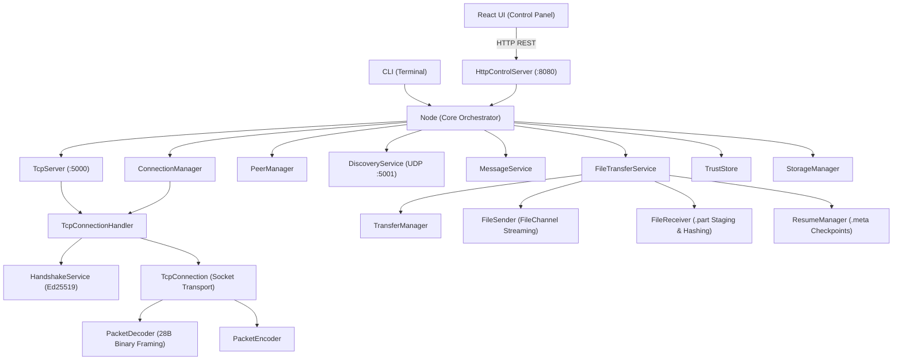

# MeshDrop Architecture Specification

## 1. System Overview

MeshDrop is a decentralized, peer-to-peer (P2P) local area network (LAN) messaging and high-speed file transfer system designed around strict separation of concerns:

- **Networking & Transfer Engine (Java 26)**: Operates autonomously with zero third-party dependencies (`java.base` only). Governs UDP peer discovery, TCP transport, Ed25519 identity, framed binary wire protocol, bounded sliding-window chunk streaming, crash-resilient checkpoints, and SHA-256 verification.
- **Control Panel & User Interface (React 18 + TypeScript + Vite)**: A responsive desktop-style control interface. Connects to the local Java engine via a lightweight HTTP REST Control API (`HttpControlServer`) running on port 8080. Does not implement network protocol or transfer logic directly.

```text
┌─────────────────────────────────────────────────────────────┐
│                    React Desktop Frontend                   │
│                     (Port 3000 / Vite)                      │
└──────────────────────────────┬──────────────────────────────┘
                               │ HTTP / JSON REST
                               ▼
┌─────────────────────────────────────────────────────────────┐
│                     Java Backend Engine                     │
│                (HttpControlServer Port 8080)                │
├─────────────────────────────────────────────────────────────┤
│  • P2P TCP Server (Port 5000)                               │
│  • UDP Multicast Peer Discovery (Port 5001)                 │
│  • Ed25519 Cryptographic Handshake & Trust Store            │
│  • Sliding-Window Chunk Streaming (64 KiB - 1 MiB)           │
│  • Crash-Resilient .meta Checkpoints & Resumable Transfers  │
│  • SHA-256 End-to-End Cryptographic Verification            │
└─────────────────────────────────────────────────────────────┘
```

---

## 2. Component Hierarchy



---

## 3. Subsystem Breakdown

### 3.1 Core Subsystem (`com.meshdrop.core`)
- **`Node`**: Central facade orchestrating startup, component lifecycle, and shutdown.
- **`NodeConfig`**: Immutable configuration holding port bindings, chunk sizes, and storage paths.
- **`NodeIdentity`**: Cryptographic identity record encapsulating UUID, display name, and Ed25519 public key.

### 3.2 Network Subsystem (`com.meshdrop.network`)
- **`TcpServer`**: Non-blocking/virtual-thread listening server on port 5000 accepting inbound TCP connections.
- **`ConnectionManager`**: Coordinates outbound connections, deduplicates concurrent connection attempts, and maintains active connection registries.
- **`TcpConnection`**: High-performance socket wrapper managing framing, inbound packet decoding, and thread-safe packet writing.
- **`TcpConnectionHandler`**: Executes mutual Ed25519 cryptographic handshake upon socket establishment.

### 3.3 Protocol Subsystem (`com.meshdrop.protocol`)
- **`Packet`**: Immutable wire frame containing the 28-byte header and raw payload byte buffer.
- **`PacketType`**: Enum defining all 17 wire packet types (e.g., `HELLO`, `MESSAGE`, `FILE_OFFER`, `FILE_CHUNK`, `FILE_COMPLETE`).
- **`PacketEncoder` & `PacketDecoder`**: High-throughput binary serializer and framing parser enforcing 28-byte headers, magic bytes (`MDRP`), and payload bounds.
- **`ProtocolConstants`**: Canonical constants (magic bytes, protocol version, default chunk size, timeouts).

### 3.4 Discovery Subsystem (`com.meshdrop.discovery`)
- **`DiscoveryService`**: Manages UDP multicast beacons on `239.255.77.80:5001`, joining interfaces and processing incoming peer announcements.
- **`DiscoveryMessage`**: Binary 26+N byte beacon frame carrying node UUID, TCP port, and UTF-8 display name.
- **`DiscoveryConstants`**: Multicast addresses and timing intervals.

### 3.5 Peer Management Subsystem (`com.meshdrop.peer`)
- **`Peer`**: Model representing a mesh member with its identity, address, connection state (`DISCOVERED`, `CONNECTING`, `CONNECTED`, `DISCONNECTED`), and trust level.
- **`PeerManager`**: Thread-safe registry tracking discovered and connected peers, emitting lifecycle callbacks.
- **`PeerState`**: Canonical lifecycle states.

### 3.6 File Transfer Subsystem (`com.meshdrop.transfer`)
- **`FileTransferService`**: Top-level coordinator routing transfer packets, managing incoming offers, and tracking in-flight transfers.
- **`TransferManager`**: In-memory thread-safe registry of all active, resumable, and historical transfers.
- **`Transfer`**: Observable domain state machine tracking direction (`UPLOAD`/`DOWNLOAD`), progress percentage, transfer speed (B/s), ETA, and status.
- **`FileSender`**: Virtual-thread streaming engine reading bounded chunks from disk via `FileChannel` without loading entire files into memory.
- **`FileReceiver`**: Stages incoming chunks into `.part` staging files, maintains incremental SHA-256 digest, verifies integrity upon completion, and commits to final destination with non-destructive collision renaming.
- **`FileMetadata` & `FileChunk`**: Immutable transfer descriptors and chunk payloads.
- **`TransferCheckpoint` & `ResumeManager`**: Persists atomic `.meta` checkpoint files enabling resume after interruption without re-transferring received bytes.

### 3.7 Security & Trust Subsystem (`com.meshdrop.security`)
- **`CryptoUtils`**: Standard Java Ed25519 keypair generation, signature creation, and signature verification.
- **`IdentityFingerprint`**: Formats 32-character uppercase hex fingerprints derived from SHA-256 hashes of Ed25519 public keys.
- **`TrustStore`**: Disk-backed persistent trust registry (`TRUSTED`, `UNTRUSTED`, `BLOCKED`) with MITM key change detection.
- **`HashUtils`**: Streaming SHA-256 hash calculator using bounded memory buffers.

### 3.8 Storage Subsystem (`com.meshdrop.storage`)
- **`StorageManager`**: Manages dedicated directories (`downloads/`, `temp/`, `identity/`, `trust/`, `logs/`). Enforces path sanitization to prevent directory traversal and overwrite attacks.

### 3.9 Control API Subsystem (`com.meshdrop.api`)
- **`HttpControlServer`**: Built-in HTTP server on port 8080 powered by `com.sun.net.httpserver.HttpServer` and Java virtual threads. Supports CORS, preflight `OPTIONS`, and REST endpoints for UI integration.
- **`JsonUtils`**: Lightweight JSON serialization and deserialization utility using standard Java string parsing.

---

## 4. Concurrency Model

- **Java 26 Virtual Threads**: All socket I/O loops, packet dispatchers, chunk streaming tasks, and HTTP request handlers run on lightweight virtual threads (`Thread.ofVirtual()`).
- **Zero Blocking of Protocol Event Loops**: Long-running operations (such as initial file hashing) execute asynchronously in dedicated virtual threads, keeping the control server and peer communication instantly responsive.
