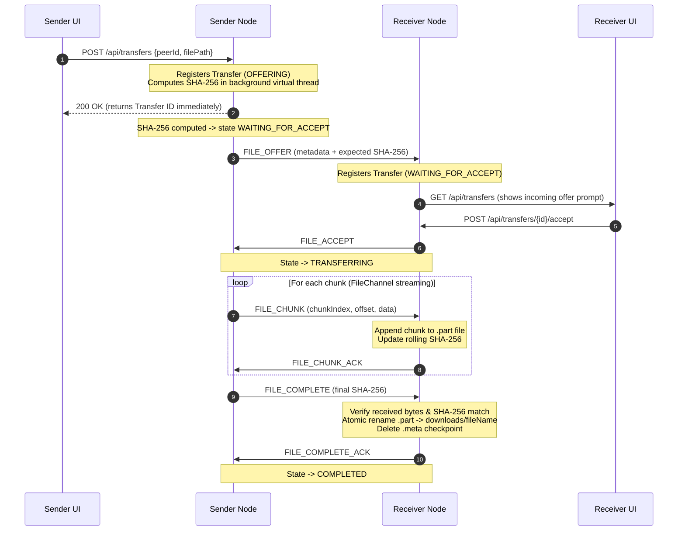

# MeshDrop File Transfer Specification

## 1. Design Overview

MeshDrop's file transfer subsystem is built to deliver fast, reliable, memory-bounded, and resumable peer-to-peer file transfers over LAN:

- **Zero Third-Party Dependencies**: Uses standard Java `FileChannel`, `ByteBuffer`, and `MessageDigest`.
- **Memory Bounded ($O(1)$ RAM)**: Files are streamed sequentially in bounded chunks (default 64 KiB, up to 1 MiB). Whole files are never loaded into RAM.
- **Cryptographic Verification**: The sender calculates SHA-256 upfront (in an asynchronous virtual thread to keep UI responsive); the receiver maintains an incremental streaming SHA-256 digest on disk and verifies against expected hash upon completion.
- **Atomic Staging & Crash Resilience**: Incoming transfers write to temporary `.part` files alongside atomic `.meta` JSON checkpoints. If the process is terminated or the network drops, transfers can resume from the checkpoint without re-downloading existing chunks.
- **Filesystem Security**: Directory traversal attacks (`../../`) and special characters are stripped, downloads are strictly confined to the designated downloads directory, and existing files with matching names receive collision numbers (`file (1).ext`) rather than being overwritten.

---

## 2. Transfer Lifecycle & Dataflow



---

## 3. Resumable Transfers & Checkpoints

When an active transfer is interrupted (e.g., socket EOF, timeout, network disconnect, or manual pause):
1. **Checkpoint Persistence**: The receiver persists the exact byte count received and verified to a companion `.transfer-<UUID>.meta` file.
2. **Resumption Handshake**:
   - When the connection is restored or the user clicks "Resume", the initiator sends a `FILE_RESUME_OFFER` carrying the transfer UUID and known offset.
   - The remote peer validates the request, inspects the `.part` file size, and responds with `FILE_RESUME_ACCEPT` specifying the agreed byte offset.
   - The sender seeks its `FileChannel` to the agreed offset (`channel.position(resumeOffset)`) and resumes chunk delivery without transferring redundant bytes.
3. **Completion & Cleanup**: Once the final chunk is verified, both the `.part` file and `.meta` checkpoint are removed, and the complete file is moved to `downloads/`.

---

## 4. Transfer States

```text
UPLOAD:
OFFERING ──► WAITING_FOR_ACCEPT ──► ACCEPTED ──► TRANSFERRING ──► VERIFYING ──► COMPLETED
   │                  │                 │              │              │
   └──────────────────┴─────────────────┴──────────────┴──────────────┴──► RESUMABLE / FAILED / CANCELLED / REJECTED

DOWNLOAD:
WAITING_FOR_ACCEPT ──► ACCEPTED ──► TRANSFERRING ──► VERIFYING ──► COMPLETED
   │                       │              │              │
   └───────────────────────┴──────────────┴──────────────┴──► RESUMABLE / FAILED / CANCELLED / REJECTED
```
